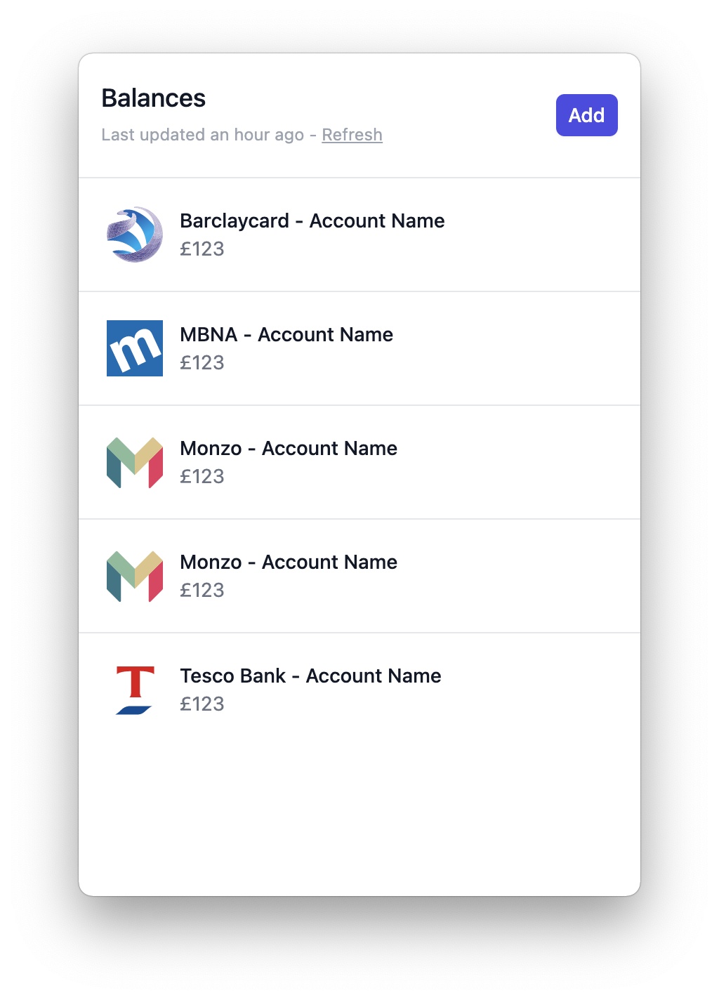
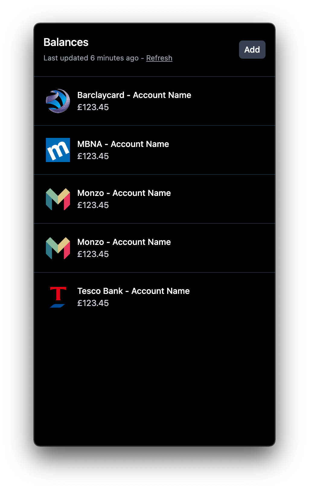

# Balance

Show your bank balances in your Menu Bar using TrueLayer.

<div align="center">
  
  
</div>

- Uses Open Banking (via TrueLayer)
- All data is stored and processed locally, no third party servers involved (other than TrueLayer, obviously)
- Secrets stored in Keychain
- Supports all TrueLayer supported banks
- Dark mode
- Refresh balances on-demand, or every hour automatically
- Multiple accounts per bank
- Click account to copy balance

## Usage

> Docs coming soon.

## Development

```bash
# install dependencies
yarn install

# Start the app
yarn dev

# build electron application for production
yarn build

# lint all JS/Vue component files in `src/`
yarn lint

```
